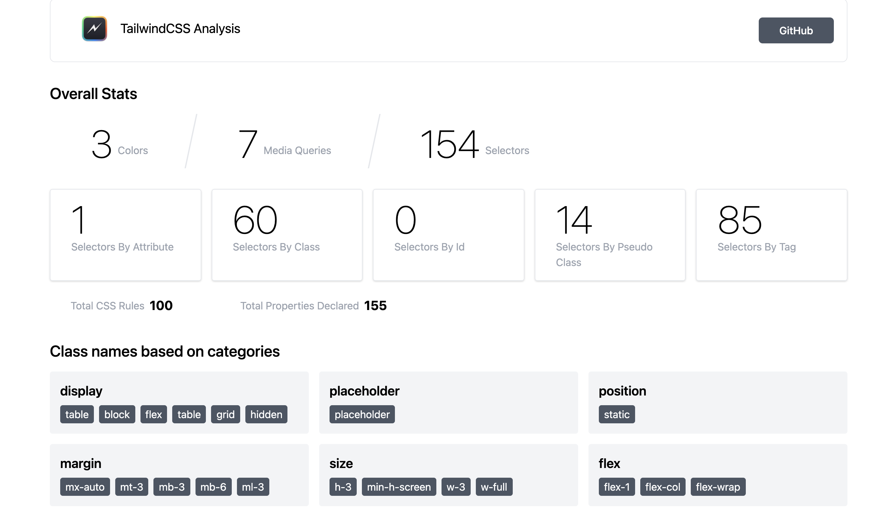

# TailwindCSS Analysis


Analyse the TailwindCSS classes used in your application


Here's why:

- Get overall view of the styles used in your project. Helps to monitor if any styles are prohibited in your organization. (One might not prefer CSS grid if the application needs to support IE browser)
- View the overview of colors and fonts used in the application. Useful for verification by the design team

## Usage

Navigate to the project that uses the TailwindCSS and run the command to generate the analysis report.

```
npx tailwindcss-analysis
```

## Screenshots



[View Live Report](https://tailwindcss-analysis.netlify.app/)

## Roadmap

- [ ] Display file size (minified and gzipped)
- [ ] Cleanup CSS output after execution
- [ ] Show human-readable values for colors and fonts

See the [open issues](https://github.com/apvarun/tailwindcss-analysis/issues) for a list of proposed features (and known issues).

## Contributing

Pull requests are welcome. For major changes, please open an issue first to discuss what you would like to change.

## Authors

- [@apvarun](https://twitter.com/apvarun)

See also the list of [contributors](https://github.com/apvarun/tailwindcss-analysis/contributors) who participated in this project.


## Acknowledgments

This project is inspired by [windicss-analysis](https://github.com/windicss/windicss-analysis).

## 🤝 Support

Contributions, issues, and feature requests are welcome!

Give a ⭐️ if you like this project!

<a href="https://www.buymeacoffee.com/apvarun" target="_blank" rel="noopener"></a>

## License

[MIT](LICENSE)
